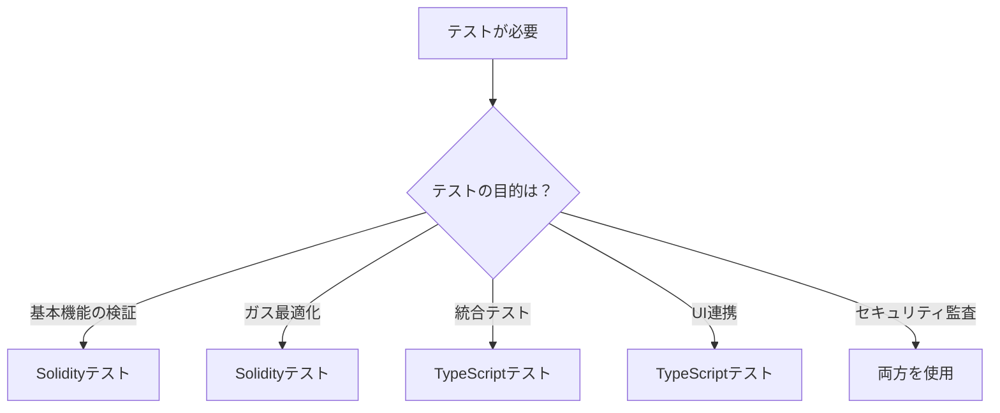

# HardhatにおけるSolidityテストとTypeScriptテストの比較

**日付**: 2025年9月28日
**学習内容**: Hardhatを用いたテストケースの書き方、SolidityテストとTypeScriptテストの比較

## 1. Hardhatのテスト機能の概要

### 1.1 Hardhat 3のテスト環境

Hardhat 3では、2つの異なるテスト方式をサポートしています：

1. **Solidityテスト**: Foundry/Forge形式のテスト（`.t.sol`ファイル）
2. **TypeScriptテスト**: Node.js/Viem/Ethersを使用したテスト（`.ts`ファイル）

両方のテスト形式を同時に使用でき、`npx hardhat test`コマンドで両方が実行されます。

### 1.2 テストファイルの構成

```
hardhat/
├── contracts/
│   ├── Counter.sol         # 本体のコントラクト
│   └── Counter.t.sol        # Solidityで書かれたテスト
└── test/
    └── Counter.ts           # TypeScriptで書かれたテスト
```

## 2. Solidityテスト（Counter.t.sol）の詳細

### 2.1 基本構造

```solidity
// SPDX-License-Identifier: UNLICENSED
pragma solidity ^0.8.28;

import {Counter} from "./Counter.sol";
import {Test} from "forge-std/Test.sol";

contract CounterTest is Test {
  Counter counter;

  function setUp() public {
    counter = new Counter();
  }

  function test_InitialValue() public view {
    require(counter.x() == 0, "Initial value should be 0");
  }

  function testFuzz_Inc(uint8 x) public {
    for (uint8 i = 0; i < x; i++) {
      counter.inc();
    }
    require(counter.x() == x, "Value after calling inc x times should be x");
  }

  function test_IncByZero() public {
    vm.expectRevert();
    counter.incBy(0);
  }
}
```

### 2.2 Solidityテストの特徴

**メリット：**
- **オンチェーン実行**: 実際のEVM環境で実行される
- **ガスコスト最適化**: ガス使用量を直接測定可能
- **ファズテスト**: `testFuzz_`プレフィックスで自動的にランダムテスト
- **チートコード**: `vm.expectRevert()`など強力な検証機能
- **コンパクト**: テストロジックがシンプルで読みやすい

**デメリット：**
- **外部依存の制限**: 外部APIやデータベースへのアクセスが困難
- **デバッグの難しさ**: TypeScriptほどデバッグツールが充実していない
- **学習曲線**: Solidityの知識が必要

### 2.3 Solidityテストの命名規則

| プレフィックス | 用途 | 例 |
|------------|------|-----|
| `test` | 通常のテストケース | `test_InitialValue()` |
| `testFuzz_` | ファジングテスト | `testFuzz_Inc(uint8 x)` |
| `testFail` | 失敗を期待するテスト | `testFail_Unauthorized()` |
| `invariant` | 不変条件のテスト | `invariant_BalanceSum()` |

## 3. TypeScriptテスト（Counter.ts）の詳細

### 3.1 基本構造

```typescript
import { expect } from "chai";
import { describe, it } from "node:test";
import { network } from "hardhat";

describe("Counter", async function () {
  const { viem } = await network.connect();
  const publicClient = await viem.getPublicClient();

  it("Should emit the Increment event when calling the inc() function", async function () {
    const counter = await viem.deployContract("Counter");

    await viem.assertions.emitWithArgs(
      counter.write.inc(),
      counter,
      "Increment",
      [1n],
    );
  });

  it("The sum of the Increment events should match the current value", async function () {
    const counter = await viem.deployContract("Counter");
    const deploymentBlockNumber = await publicClient.getBlockNumber();

    // run a series of increments
    for (let i = 1n; i <= 10n; i++) {
      await counter.write.incBy([i]);
    }

    const events = await publicClient.getContractEvents({
      address: counter.address,
      abi: counter.abi,
      eventName: "Increment",
      fromBlock: deploymentBlockNumber,
      strict: true,
    });

    // check that the aggregated events match the current value
    let total = 0n;
    for (const event of events) {
      total += event.args.by;
    }

    expect(total).to.equal(await counter.read.x());
  });
});
```

### 3.2 TypeScriptテストの特徴

**メリット：**
- **豊富なツール**: デバッガ、テストフレームワーク、アサーションライブラリ
- **外部統合**: API、データベース、他のサービスとの連携が容易
- **詳細なテスト**: イベント、トランザクション、状態変化の詳細な検証
- **開発者フレンドリー**: JavaScript/TypeScriptの知識で書ける

**デメリット：**
- **実行速度**: Solidityテストより遅い場合がある
- **セットアップの複雑さ**: 依存関係の管理が必要
- **間接的な実行**: RPC経由でのテスト実行

### 3.3 使用可能なライブラリ

| ライブラリ | 用途 | インストール |
|----------|------|------------|
| Viem | Web3インタラクション | `@nomicfoundation/hardhat-toolbox-viem` |
| Chai | アサーション | `npm install --save-dev chai @types/chai` |
| Mocha | テストランナー（オプション） | `npm install --save-dev mocha @types/mocha` |
| Ethers | Web3インタラクション（代替） | `npm install --save-dev ethers` |

## 4. テスト手法の比較表

### 4.1 機能比較

| 機能 | Solidityテスト | TypeScriptテスト |
|------|--------------|----------------|
| **実行環境** | EVM内部 | Node.js + RPC |
| **テスト速度** | 高速 | 中速 |
| **ガス測定** | ネイティブサポート | 間接的 |
| **ファズテスト** | 組み込み | ライブラリ必要 |
| **イベント検証** | 基本的 | 詳細 |
| **外部データ** | 制限あり | 自由 |
| **デバッグ** | 基本的 | 高度 |
| **学習難易度** | 中～高 | 低～中 |

### 4.2 ユースケース比較

| ユースケース | 推奨テスト方式 | 理由 |
|------------|--------------|------|
| **基本的な機能テスト** | Solidity | シンプルで高速 |
| **ガス最適化** | Solidity | 直接的な測定が可能 |
| **ファズテスト** | Solidity | ネイティブサポート |
| **統合テスト** | TypeScript | 外部システムとの連携 |
| **UIとの連携テスト** | TypeScript | フロントエンドとの統合 |
| **複雑なシナリオ** | TypeScript | 柔軟な制御が可能 |
| **イベントログ解析** | TypeScript | 詳細な解析ツール |

## 5. 実装例の比較

### 5.1 初期値のテスト

**Solidityでの実装：**
```solidity
function test_InitialValue() public view {
    require(counter.x() == 0, "Initial value should be 0");
}
```

**TypeScriptでの実装：**
```typescript
it("Should have initial value of 0", async function () {
    const counter = await viem.deployContract("Counter");
    const value = await counter.read.x();
    expect(value).to.equal(0n);
});
```

### 5.2 リバートのテスト

**Solidityでの実装：**
```solidity
function test_IncByZero() public {
    vm.expectRevert();
    counter.incBy(0);
}
```

**TypeScriptでの実装：**
```typescript
it("Should revert when incrementing by 0", async function () {
    const counter = await viem.deployContract("Counter");
    await expect(counter.write.incBy([0n])).to.be.rejected;
});
```

### 5.3 イベントのテスト

**Solidityでの実装：**
```solidity
function test_EmitEvent() public {
    vm.expectEmit(true, true, true, true);
    emit Increment(1);
    counter.inc();
}
```

**TypeScriptでの実装：**
```typescript
it("Should emit Increment event", async function () {
    const counter = await viem.deployContract("Counter");
    await viem.assertions.emitWithArgs(
        counter.write.inc(),
        counter,
        "Increment",
        [1n],
    );
});
```

## 6. テスト環境のセットアップ

### 6.1 Solidityテストの準備

```bash
# Forge標準ライブラリのインストール（既にpackage.jsonに含まれている）
npm install --save-dev forge-std@github:foundry-rs/forge-std#v1.9.4

# テストファイルの作成
touch contracts/MyContract.t.sol
```

### 6.2 TypeScriptテストの準備

```bash
# Viemツールボックスのインストール（Hardhat 3デフォルト）
npm install --save-dev @nomicfoundation/hardhat-toolbox-viem

# Chaiアサーションライブラリの追加
npm install --save-dev chai @types/chai

# テストファイルの作成
touch test/MyContract.ts
```

### 6.3 ハイブリッド環境の設定（Chai + Node:test）

```typescript
// Hardhat 3でのハイブリッドアプローチ
import { expect } from "chai";              // Chaiのアサーション
import { describe, it } from "node:test";   // Node.jsテストランナー
import { network } from "hardhat";          // Hardhatネットワーク

// これにより、Chaiの豊富なアサーションとNode.jsの標準テストランナーを組み合わせられる
```

## 7. テストの実行方法

### 7.1 全テストの実行

```bash
# Solidityテストと TypeScriptテストの両方を実行
npx hardhat test
```

**実行結果の例：**
```
Compiling your Solidity contracts...

Running Solidity tests

  contracts/Counter.t.sol:CounterTest
    ✔ test_InitialValue()
    ✔ test_IncByZero()
    ✔ testFuzz_Inc(uint8) (runs: 256)

  3 passing

Running node:test tests

  Counter
    ✔ Should emit the Increment event when calling the inc() function
    ✔ The sum of the Increment events should match the current value

  2 passing (1913ms)
```

### 7.2 特定のテストファイルの実行

```bash
# TypeScriptテストのみ
npx hardhat test test/Counter.ts

# Solidityテストのみ
npx hardhat test contracts/Counter.t.sol
```

### 7.3 package.jsonのスクリプト設定

```json
{
  "scripts": {
    "test": "hardhat test",
    "test:solidity": "hardhat test contracts/*.t.sol",
    "test:typescript": "hardhat test test/*.ts",
    "test:coverage": "hardhat coverage"
  }
}
```

## 8. ベストプラクティス

### 8.1 テスト戦略の選択



### 8.2 テストの組み合わせ方

1. **コアロジック**: Solidityテストで基本機能を高速に検証
2. **エッジケース**: ファズテストで予期しない入力を検証
3. **統合動作**: TypeScriptテストで実際の使用シナリオを検証
4. **パフォーマンス**: Solidityテストでガス使用量を最適化

### 8.3 テストの命名規則

**Solidityテスト：**
- `test_FunctionName_Condition`: 通常のテスト
- `testFuzz_FunctionName`: ファジングテスト
- `testFail_FunctionName_Reason`: 失敗を期待

**TypeScriptテスト：**
- `Should [expected behavior] when [condition]`
- `Should revert when [invalid condition]`
- `Should emit [EventName] event when [action]`

## 9. トラブルシューティング

### 9.1 よくあるエラーと解決方法

**Solidityテストのエラー：**
```
Error: setUp() failed
```
**解決**: `setUp()`関数内のコントラクトデプロイを確認

**TypeScriptテストのエラー：**
```
ReferenceError: describe is not defined
```
**解決**: `import { describe, it } from "node:test"`を追加

**Mochaを使用したい場合のエラー：**
```
Unknown file extension ".ts"
```
**解決**: Hardhat 3のデフォルトはNode.jsテストランナー。Mochaプラグインを追加するか、Node.jsテストランナーを使用

### 9.2 デバッグテクニック

**Solidityテスト：**
```solidity
// console.logの使用
import "hardhat/console.sol";

function test_Debug() public {
    console.log("Value:", counter.x());
}
```

**TypeScriptテスト：**
```typescript
// 詳細なログ出力
console.log("Contract address:", counter.address);
console.log("Transaction hash:", txHash);
console.log("Gas used:", receipt.gasUsed);
```

## 10. 高度なテスト技法

### 10.1 ファズテストの活用

**Solidityでのファズテスト：**
```solidity
function testFuzz_ComplexScenario(
    uint256 amount,
    address user,
    bytes32 data
) public {
    vm.assume(amount > 0 && amount < 1e18);
    vm.assume(user != address(0));
    // テストロジック
}
```

**TypeScriptでのプロパティベーステスト：**
```typescript
import fc from 'fast-check';

it("Should handle random inputs", async () => {
    await fc.assert(
        fc.asyncProperty(fc.nat(), async (value) => {
            const result = await counter.write.incBy([BigInt(value)]);
            // アサーション
        })
    );
});
```

### 10.2 ガスレポート

```bash
# ガス使用量のレポート生成
REPORT_GAS=true npx hardhat test
```

### 10.3 カバレッジ測定

```bash
# テストカバレッジの測定
npx hardhat coverage
```

## 11. 学習の成果

### 11.1 習得したスキル

1. **Solidityテストの記述**: Foundry/Forge形式でのテスト実装
2. **TypeScriptテストの記述**: Viem/Chaiを使用したテスト実装
3. **テストランナーの理解**: Node.jsテストランナーとMochaの違い
4. **ハイブリッドアプローチ**: 両方のテスト手法の組み合わせ
5. **アサーションライブラリ**: Chaiの活用方法

### 11.2 重要な学び

- **適材適所**: テストの目的に応じて適切な手法を選択
- **相補的な関係**: SolidityテストとTypeScriptテストは補完関係
- **効率的なテスト**: 基本機能はSolidity、統合テストはTypeScript
- **継続的な検証**: 両方のテストを CI/CD パイプラインに組み込む

## 12. 今後の展開

### 12.1 次のステップ

1. **テストカバレッジの向上**: 100%カバレッジを目指す
2. **CI/CD統合**: GitHub Actionsでの自動テスト
3. **ミューテーションテスト**: テストの品質検証
4. **形式検証**: 数学的証明によるコントラクト検証

### 12.2 応用分野

- **DeFiプロトコル**: 複雑な金融ロジックのテスト
- **NFTコントラクト**: ミント、転送、権限管理のテスト
- **DAO**: ガバナンス機能のテスト
- **Bridge**: クロスチェーン機能のテスト

### 12.3 推奨リソース

- [Foundry Book](https://book.getfoundry.sh/): Solidityテストの詳細
- [Viem Documentation](https://viem.sh/): TypeScriptテストのAPI
- [Hardhat Testing](https://hardhat.org/hardhat-runner/docs/guides/test-contracts): Hardhatのテストガイド
- [Chai Assertion Library](https://www.chaijs.com/): アサーションの詳細

---

**まとめ**:
Hardhatにおけるテストは、SolidityテストとTypeScriptテストの両方を活用することで、包括的で信頼性の高いスマートコントラクト開発が可能になります。それぞれの長所を理解し、プロジェクトの要求に応じて適切に使い分けることが重要です。