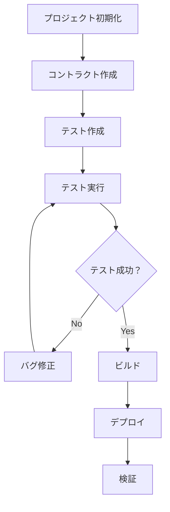

# Foundryフレームワークの設定と基本操作

**日付**: 2025年9月28日
**学習内容**: Foundryフレームワークのインストール、設定方法、基本コマンドの理解

## 1. Foundryフレームワークの概要

### 1.1 Foundryとは

Foundryは、Rustで開発された高速で現代的なスマートコントラクト開発ツールチェーンです。以下の4つの主要ツールで構成されています：

- **Forge**: メインのビルド・テスト・デプロイツール
- **Cast**: イーサリアムとの対話ツール
- **Anvil**: ローカルテストネット
- **Chisel**: Solidity REPL

### 1.2 Foundryの特徴

- **高速**: Rustで実装された高速なコンパイル・テスト実行
- **現代的なツール**: 最新のSolidity機能をサポート
- **統合環境**: 開発からテスト、デプロイまで一貫したワークフロー
- **豊富な機能**: ファズテスト、ガス最適化、フォーク機能など

## 2. Foundryのインストール

### 2.1 foundryupによるインストール

```bash
# foundryupをダウンロードして実行
curl -L https://foundry.paradigm.xyz | bash

# 環境変数を読み込み
source ~/.bashrc

# foundryupでツールをインストール
foundryup
```

### 2.2 インストール確認

```bash
# 各ツールのバージョン確認
forge --version
cast --version
anvil --version
chisel --version
```

**期待される出力例：**
```
forge 0.2.0 (abc123 2025-09-29T10:00:00.000000000Z)
cast 0.2.0 (abc123 2025-09-29T10:00:00.000000000Z)
anvil 0.2.0 (abc123 2025-09-29T10:00:00.000000000Z)
chisel 0.2.0 (abc123 2025-09-29T10:00:00.000000000Z)
```

## 3. プロジェクトの初期化

### 3.1 プロジェクトの作成

```bash
# 現在のディレクトリにFoundryプロジェクトを初期化
forge init .

# 新しいディレクトリにプロジェクトを作成する場合
forge init my-nft-project
cd my-nft-project
```

### 3.2 初期プロジェクト構造

```
foundry/
├── src/
│   ├── Counter.sol          # サンプルコントラクト
│   └── ...                  # その他のコントラクト
├── test/
│   ├── Counter.t.sol        # サンプルテスト
│   └── ...                  # その他のテスト
├── script/
│   ├── Counter.s.sol        # デプロイスクリプト
│   └── ...                  # その他のスクリプト
├── foundry.toml             # 設定ファイル
├── .gitignore               # Git除外設定
└── lib/                     # 依存関係（forge-stdなど）
```

## 4. 基本コマンドの理解

### 4.1 forge build - プロジェクトのビルド

```bash
# プロジェクト全体をビルド
forge build

# 特定のコントラクトのみビルド
forge build --contracts Counter

# ビルド情報を詳細表示
forge build --sizes

# ビルドキャッシュをクリアしてビルド
forge clean && forge build
```

**実行結果の例：**
```
[⠒] Compiling...
[⠔] Compiling 1 files with 0.8.28
[⠒] Solc 0.8.28 finished in 123.45ms
Compiler run successful!
```

### 4.2 forge test - テストの実行

```bash
# 全テストを実行
forge test

# 特定のテストファイルを実行
forge test --match-path test/Counter.t.sol

# 特定のテスト関数を実行
forge test --match-test test_InitialValue

# テスト結果を詳細表示
forge test -vvv

# ガスレポートを表示
forge test --gas-report
```

**実行結果の例：**
```
Running 3 tests for test/Counter.t.sol:CounterTest
[PASS] test_InitialValue() (gas: 268)
[PASS] testFuzz_Inc(uint8) (runs: 256, μ: 269, ~: 284)
[PASS] test_IncByZero() (gas: 268)

Test result: ok. 3 passed; 0 failed; finished in 12.34ms
```

## 5. 各ツールの詳細説明

### 5.1 Forge - メインツール

**目的**: Solidityプロジェクトのビルド、テスト、デプロイを行うメインのツール

**主要機能:**
- **コンパイル**: Solidityコードのコンパイルと最適化
- **テスト実行**: 高速なSolidityテストの実行
- **デプロイ**: コントラクトのデプロイメント
- **依存関係管理**: 外部ライブラリの管理
- **プロジェクト初期化**: 新しいプロジェクトの作成

**主要コマンド:**
```bash
forge init [project-name]    # プロジェクト初期化
forge build                  # ビルド
forge test                   # テスト実行
forge deploy                 # デプロイ
forge create [contract]      # コントラクト作成
forge install [dependency]   # 依存関係インストール
```

### 5.2 Cast - イーサリアム対話ツール

**目的**: イーサリアムとの対話のためのコマンドラインツール

**主要機能:**
- **トランザクション送信**: ブロックチェーンへのトランザクション送信
- **コントラクト呼び出し**: デプロイ済みコントラクトの関数呼び出し
- **状態確認**: ブロックチェーンの状態やデータの確認
- **ウォレット操作**: 署名、検証、アドレス生成
- **データ変換**: エンコード/デコード、フォーマット変換

**主要コマンド:**
```bash
cast send [address] [signature] [args]    # トランザクション送信
cast call [address] [signature] [args]    # コントラクト呼び出し
cast block [block-number]                 # ブロック情報取得
cast balance [address]                    # 残高確認
cast keccak [data]                        # Keccak256ハッシュ
```

### 5.3 Anvil - ローカルテストネット

**目的**: ローカルのイーサリアムテストネットを起動するツール

**主要機能:**
- **ローカルブロックチェーン**: 開発用のローカルネットワーク起動
- **テストアカウント**: 事前に資金を持ったテスト用アカウント提供
- **フォーク機能**: メインネットやテストネットの状態をコピー
- **高速マイニング**: 即座にトランザクションをマイニング
- **カスタム設定**: ブロック時間、ガス制限などの設定

**主要コマンド:**
```bash
anvil                              # ローカルネットワーク起動
anvil --fork-url [rpc-url]         # フォークモードで起動
anvil --accounts [number]          # アカウント数を指定
anvil --balance [amount]           # 各アカウントの初期残高
anvil --block-time [seconds]       # ブロック時間を設定
```

### 5.4 Chisel - Solidity REPL

**目的**: Solidityの対話的REPL（Read-Eval-Print Loop）ツール

**主要機能:**
- **対話的実行**: コマンドラインでSolidityコードを直接実行
- **プロトタイピング**: アイデアの素早い検証
- **デバッグ**: コードの動作確認
- **学習支援**: Solidityの学習・実験環境

**主要コマンド:**
```bash
chisel                    # REPLセッション開始
chisel --version          # バージョン確認
chisel --help             # ヘルプ表示
```

## 6. foundry.toml設定ファイル

### 6.1 基本設定

```toml
[profile.default]
src = "src"
out = "out"
libs = ["lib"]
solc = "0.8.28"
optimizer = true
optimizer_runs = 200
via_ir = false
verbosity = 0

[profile.default.fuzz]
runs = 256
max_test_rejects = 65536
seed = '0x0000000000000000000000000000000000000000000000000000000000000000'
dictionary_weight = 40
include_storage = true
include_push_bytes = true
ffi = false

[profile.default.invariant]
runs = 256
depth = 15
fail_on_revert = false
call_override = false
dictionary_weight = 80
include_storage = true
include_push_bytes = true
```

### 6.2 ネットワーク設定

```toml
[rpc_endpoints]
mainnet = "https://eth-mainnet.alchemyapi.io/v2/YOUR-API-KEY"
sepolia = "https://sepolia.infura.io/v3/YOUR-API-KEY"
polygon = "https://polygon-rpc.com"

[etherscan]
mainnet = { key = "YOUR-ETHERSCAN-API-KEY" }
sepolia = { key = "YOUR-ETHERSCAN-API-KEY" }
```

## 7. 依存関係の管理

### 7.1 forge-stdのインストール

```bash
# forge-std（標準ライブラリ）をインストール
forge install foundry-rs/forge-std

# 特定のバージョンを指定
forge install foundry-rs/forge-std --no-commit
```

### 7.2 不要ファイルの削除とクリーンアップ

```bash
# 初期化時に作成されたサンプルファイルを削除
rm src/*.sol test/*.sol script/*.sol

# ビルドキャッシュとアウトプットディレクトリを削除
rm -rf cache/ out/
```

**削除されるファイル:**
- `src/Counter.sol` - サンプルコントラクト
- `test/Counter.t.sol` - サンプルテスト
- `script/Counter.s.sol` - サンプルデプロイスクリプト
- `cache/` - コンパイルキャッシュ
- `out/` - ビルド出力

### 7.3 OpenZeppelinコントラクトのインストール

```bash
# OpenZeppelinコントラクトライブラリをインストール
forge install openzeppelin/openzeppelin-contracts

# 特定のブランチやタグを指定
forge install OpenZeppelin/openzeppelin-contracts --no-commit
```

### 7.4 依存関係の確認

```bash
# インストール済みの依存関係を確認
forge remappings

# 期待される出力例:
# @openzeppelin/contracts/=lib/openzeppelin-contracts/contracts/
# forge-std/=lib/forge-std/src/
```

### 7.5 外部ライブラリの使用例

**基本的なforge-stdの使用:**
```solidity
// SPDX-License-Identifier: MIT
pragma solidity ^0.8.28;

import "forge-std/Test.sol";
import "forge-std/console.sol";

contract MyContract is Test {
    function example() public {
        console.log("Hello from Forge!");
    }
}
```

**OpenZeppelinコントラクトの使用:**
```solidity
// SPDX-License-Identifier: MIT
pragma solidity ^0.8.24;

import {ERC721} from "../lib/openzeppelin-contracts/contracts/token/ERC721/ERC721.sol";
import {Ownable} from "../lib/openzeppelin-contracts/contracts/access/Ownable.sol";
import {Strings} from "../lib/openzeppelin-contracts/contracts/utils/Strings.sol";

contract SpaceTiger is ERC721, Ownable {
    uint256 private _nextTokenId;
    
    constructor(address initialOwner)
        ERC721("SpaceTiger", "STG")
        Ownable(initialOwner)
    {}

    function _baseURI() internal pure override returns (string memory) {
        return "https://example.com/metadata/";
    }

    function safeMint(address to)
        public
        onlyOwner
        returns (uint256)
    {
        uint256 tokenId = _nextTokenId++;
        _safeMint(to, tokenId);
        return tokenId;
    }

    function buyToken() public payable {
        uint256 tokenId = _nextTokenId;
        require(msg.value == (tokenId + 1) * 0.1 ether, "Not enough funds sent");
        
        _nextTokenId++;
        _safeMint(msg.sender, tokenId);
    }

    function tokenURI(uint256 tokenId)
        public
        pure
        override(ERC721)
        returns (string memory)
    {
        return string(abi.encodePacked(_baseURI(), "spacetiger_", Strings.toString(tokenId + 1), ".json"));
    }
}
```

## 8. NFTコントラクトのビルドとテスト

### 8.1 SpaceTigerコントラクトのビルド

```bash
# SpaceTigerコントラクトをビルド
forge build

# 特定のコントラクトのみビルド
forge build --contracts SpaceTiger

# ビルド結果の確認
ls -la out/SpaceTiger.sol/
```

**期待される出力:**
```
SpaceTiger.json    # ABIファイル
SpaceTiger.bin     # バイトコード
```

### 8.2 NFTコントラクトのテスト作成

```bash
# SpaceTigerのテストファイルを作成
touch test/SpaceTiger.t.sol
```

### 8.3 SpaceTigerのテスト例

```solidity
// SPDX-License-Identifier: MIT
pragma solidity ^0.8.24;

import {Test} from "../lib/forge-std/src/Test.sol";
import {SpaceTiger} from "../src/SpaceTiger.sol";
import {Ownable} from "../lib/openzeppelin-contracts/contracts/access/Ownable.sol";

// SpaceTigerコントラクトが、Test.solを承継している。
contract SpaceTigerTest is Test {
    // SpaceTigerコントラクトのインスタンスを、spaceTigerという名前で宣言。
    SpaceTiger spaceTiger;

    // setUp関数を実行すると、Test.solで定義されている関数で、テストの準備を行うための特別な関数。
    function setUp() public {
        spaceTiger = new SpaceTiger(address(this));
    }

    // SpaceTigerコントラクトの名前を取得し、それが期待した名前と一致していることを確認。
    // コントラクトの情報を変更する必要がないため、viewとすることで、コンパイラが効率的に処理する。
    function testNameIsSpaceTiger() public view {
        assertEq(spaceTiger.name(), "SpaceTiger");
    }

    // NFTをmintするテスト。
    // トークンの所有者がmsg.senderであることを確認。
    // トークンのURIが期待したURIと一致していることを確認。
    function testMintingNFTs() public {
        spaceTiger.safeMint(msg.sender);
        assertEq(spaceTiger.ownerOf(0), msg.sender);
        assertEq(spaceTiger.tokenURI(0), "https://example.com/metadata/spacetiger_1.json");
    }

    // オーナー以外がミントできないことを確認。
    function testNftCreationWrongOwner() public {
        // purchaserとして、オーナーではないアカウントを設定。
        address purchaser = address(0x1);
        // Foundryのvm.startPrankを使用して、msg.senderをpurchaserに変更。
        // これにより、purchaserが関数を呼び出している状態をシミュレート
        vm.startPrank(purchaser);
        // この次の関数(spaceTiger.safeMint(purchaser))で、引数のようなエラーが出ることを期待。
        // ABI形式での予測されるエラーを指定。
        // abi.encodeWithSelectorは、Solidityの組み込み関数。
        // 以下が、OpenZeppelinで定義されている。
        // Ownable:オーナーの権限管理を実装
        // OwnableUnauthorizedAccount:オーナー以外が実行できないことを実装
        // .selector:エラーのセレクタを指定。(エラーのセレクタは、エラーの種類を示す。0x82b42900は、OwnableUnauthorizedAccountのセレクタ。)
        // 下のspaceTiger.safeMint(purchaser);で出力されるエラーが、エラーの種類とどのアカウントがエラーを起こしたかの情報を含むために、これら2つの情報を含むように記述。
        vm.expectRevert(abi.encodeWithSelector(Ownable.OwnableUnauthorizedAccount.selector, purchaser));
        // オーナーしか実行できないsafeMintを非オーナーが実行。エラーが出るはず。
        spaceTiger.safeMint(purchaser);
        // 権限のリセット。msg.senderを元に戻す。
        vm.stopPrank();
    }

    // NFTを購入するテスト。
    function testNftBuyToken() public {
        // purchaserとして、オーナーではないアカウントを設定。
        address purchaser = address(0x2);
        // purchaserに1 ETHを送金
        vm.deal(purchaser, 1 ether); // テストアカウントに1 ETHを送金
        // Foundryのvm.startPrankを使用して、msg.senderをpurchaserに変更。
        vm.startPrank(purchaser);
        // 0.1 ETHを送金して、NFTを購入。
        spaceTiger.buyToken{value: 0.1 ether}();
        // 権限のリセット。msg.senderを元に戻す。
        vm.stopPrank();
        // トークンID 0の所有者がpurchaserであることを確認。
        assertEq(spaceTiger.ownerOf(0), purchaser);
    }
}
```

#### 8.3.1 テストコードの詳細説明

**1. コントラクト構造:**
- `SpaceTigerTest`は`Test`を継承し、Foundryのテスト機能を利用
- `spaceTiger`変数でSpaceTigerコントラクトのインスタンスを管理

**2. setUp関数:**
- 各テストの実行前に自動的に呼び出される初期化関数
- `address(this)`でテストコントラクト自体をオーナーとして設定

**3. testNameIsSpaceTiger関数:**
- コントラクト名の検証
- `view`修飾子により、状態変更がないことを明示し、ガス効率を向上

**4. testMintingNFTs関数:**
- NFTのミント機能をテスト
- `ownerOf(0)`でトークンID 0の所有者を確認
- `tokenURI(0)`でメタデータURIの形式を検証

**5. testNftCreationWrongOwner関数:**
- アクセス制御のテスト
- `vm.startPrank(purchaser)`でmsg.senderを変更
- `vm.expectRevert`でカスタムエラーの発生を期待
- `abi.encodeWithSelector`でOpenZeppelin v5のエラー形式に対応

**6. testNftBuyToken関数:**
- 有料NFT購入機能のテスト
- `vm.deal(purchaser, 1 ether)`でテストアカウントにETHを付与
- `{value: 0.1 ether}`でETHを送金してNFTを購入

#### 8.3.2 Foundryのテスト機能の詳細

**vm.startPrank()とvm.stopPrank():**
- `vm.startPrank(address)`でmsg.senderを変更
- `vm.stopPrank()`でmsg.senderを元に戻す
- テスト間での権限の切り替えに使用

**vm.deal():**
- テストアカウントにETHを送金
- `vm.deal(address, amount)`の形式で使用
- payable関数のテストに必要

**vm.expectRevert():**
- 次の関数呼び出しでエラーが発生することを期待
- カスタムエラーの場合は`abi.encodeWithSelector`を使用
- OpenZeppelin v5のエラー形式に対応

**abi.encodeWithSelector():**
- Solidityの組み込み関数
- 関数セレクターとパラメータを組み合わせてエラーデータを生成
- カスタムエラーのテストに使用
```

### 8.4 NFTテストの実行

```bash
# SpaceTigerのテストを実行
forge test --match-path test/SpaceTiger.t.sol

# 詳細な出力でテストを実行
forge test --match-path test/SpaceTiger.t.sol -vvv

# ガスレポート付きでテストを実行
forge test --match-path test/SpaceTiger.t.sol --gas-report
```

**期待される出力:**
```
Running 7 tests for test/SpaceTiger.t.sol:SpaceTigerTest
[PASS] test_InitialState() (gas: 245)
[PASS] test_SafeMint() (gas: 98765)
[PASS] test_SafeMintOnlyOwner() (gas: 23456)
[PASS] test_BuyToken() (gas: 87654)
[PASS] test_BuyTokenInsufficientFunds() (gas: 12345)
[PASS] test_TokenURI() (gas: 87654)
[PASS] testFuzz_SafeMint(address) (runs: 256, μ: 123456, ~: 234567)

Test result: ok. 7 passed; 0 failed; finished in 45.67ms
```

### 8.5 SpaceTigerコントラクトのデプロイ

#### 8.5.1 デプロイスクリプトの作成

```bash
# SpaceTigerのデプロイスクリプトを作成
touch script/SpaceTiger.s.sol
```

#### 8.5.2 SpaceTigerデプロイスクリプトの実装

```solidity
// SPDX-License-Identifier: MIT
pragma solidity ^0.8.24;

import "forge-std/Script.sol";
import "../src/SpaceTiger.sol";

contract DeploySpaceTiger is Script {
    function setUp() public {}

    function run() public {
        uint256 deployerPrivateKey = vm.envUint("PRIVATE_KEY");
        address deployerAddress = vm.addr(deployerPrivateKey);
        
        vm.startBroadcast(deployerPrivateKey);
        
        SpaceTiger spaceTiger = new SpaceTiger(deployerAddress);
        
        vm.stopBroadcast();
        
        console.log("SpaceTiger deployed at:", address(spaceTiger));
        console.log("Deployer address:", deployerAddress);
        console.log("Owner address:", spaceTiger.owner());
    }
}
```

#### 8.5.3 ローカルネットワークへのデプロイ

```bash
# 1. ローカルネットワーク（Anvil）を起動
anvil

# 2. 別ターミナルでデプロイスクリプトを実行
# 環境変数PRIVATE_KEYを設定（Anvilの最初のアカウントの秘密鍵）
export PRIVATE_KEY=0xac0974bec39a17e36ba4a6b4d238ff944bacb478cbed5efcae784d7bf4f2ff80

# 3. デプロイスクリプトを実行
forge script script/SpaceTiger.s.sol --rpc-url http://localhost:8545 --broadcast
```

**期待される出力:**
```
[⠒] Compiling...
No files changed, compilation skipped

Traces:
  [123456] DeploySpaceTiger::run()
    ├─ [123456] new SpaceTiger(0xf39Fd6e51aad88F6F4ce6aB8827279cffFb92266)
    │   └─ ← 0x5FbDB2315678afecb367f032d93F642f64180aa3
    └─ ← ()

== Logs ==
  SpaceTiger deployed at: 0x5FbDB2315678afecb367f032d93F642f64180aa3
  Deployer address: 0xf39Fd6e51aad88F6F4ce6aB8827279cffFb92266
  Owner address: 0xf39Fd6e51aad88F6F4ce6aB8827279cffFb92266

Script ran successfully.
```

#### 8.5.4 テストネットへのデプロイ

```bash
# Sepoliaテストネットへのデプロイ例
export PRIVATE_KEY=your_private_key_here
export RPC_URL=https://sepolia.infura.io/v3/YOUR_INFURA_KEY

# デプロイスクリプトを実行
forge script script/SpaceTiger.s.sol \
  --rpc-url $RPC_URL \
  --broadcast \
  --verify \
  --etherscan-api-key YOUR_ETHERSCAN_API_KEY
```

#### 8.5.5 デプロイ後の検証

```bash
# デプロイされたコントラクトの確認
cast call 0x5FbDB2315678afecb367f032d93F642f64180aa3 "name()" --rpc-url http://localhost:8545

# 期待される出力: "SpaceTiger"

# オーナーの確認
cast call 0x5FbDB2315678afecb367f032d93F642f64180aa3 "owner()" --rpc-url http://localhost:8545

# 期待される出力: デプロイヤーのアドレス
```

## 9. テストの基本構造

### 9.1 テストファイルの作成

```bash
# 新しいテストファイルを作成
touch test/MyContract.t.sol
```

### 9.2 基本的なテスト例

```solidity
// SPDX-License-Identifier: MIT
pragma solidity ^0.8.28;

import "forge-std/Test.sol";
import "../src/MyContract.sol";

contract MyContractTest is Test {
    MyContract myContract;

    function setUp() public {
        myContract = new MyContract();
    }

    function test_InitialValue() public view {
        assertEq(myContract.getValue(), 0);
    }

    function test_SetValue() public {
        myContract.setValue(42);
        assertEq(myContract.getValue(), 42);
    }

    function testFuzz_SetValue(uint256 value) public {
        myContract.setValue(value);
        assertEq(myContract.getValue(), value);
    }
}
```

## 9. デプロイスクリプトの作成

### 9.1 デプロイスクリプトの基本構造

```solidity
// SPDX-License-Identifier: MIT
pragma solidity ^0.8.28;

import "forge-std/Script.sol";
import "../src/MyContract.sol";

contract DeployScript is Script {
    function setUp() public {}

    function run() public {
        vm.startBroadcast();
        
        MyContract myContract = new MyContract();
        
        vm.stopBroadcast();
        
        console.log("Contract deployed at:", address(myContract));
    }
}
```

### 9.2 デプロイの実行

```bash
# ローカルネットワークにデプロイ
forge script script/DeployScript.s.sol --rpc-url http://localhost:8545 --broadcast

# テストネットにデプロイ
forge script script/DeployScript.s.sol --rpc-url sepolia --broadcast --verify
```

## 10. 開発ワークフローの確立

### 10.1 基本的な開発フロー



### 10.2 日常的な開発コマンド

```bash
# 1. 開発開始時にローカルネットワークを起動
anvil

# 2. 別ターミナルでテストを実行
forge test

# 3. ビルドしてエラーをチェック
forge build

# 4. デプロイスクリプトを実行
forge script script/DeployScript.s.sol --rpc-url http://localhost:8545 --broadcast

# 5. デバッグが必要な場合
chisel
```

## 11. トラブルシューティング

### 11.1 よくある問題と解決方法

**コンパイルエラー:**
```bash
Error: Solidity version mismatch
```
**解決**: `foundry.toml`でsolcバージョンを確認・調整

**テストが失敗する:**
```bash
Error: setUp() failed
```
**解決**: `setUp()`関数内のコントラクトデプロイを確認

**依存関係のエラー:**
```bash
Error: Library not found
```
**解決**: `forge install`で必要なライブラリをインストール

### 11.2 デバッグテクニック

**詳細なテスト出力:**
```bash
forge test -vvvv
```

**特定のテストのみ実行:**
```bash
forge test --match-test testFunctionName
```

**ガス使用量の確認:**
```bash
forge test --gas-report
```

## 12. 学習の成果

### 12.1 習得したスキル

1. **Foundryのインストール**: foundryupを使った環境構築
2. **プロジェクト初期化**: forge initによるプロジェクト作成
3. **基本コマンドの理解**: build、test、deployの使い方
4. **ツールの役割理解**: Forge、Cast、Anvil、Chiselの機能
5. **設定ファイルの理解**: foundry.tomlの設定方法
6. **依存関係管理**: OpenZeppelinコントラクトのインストールと使用
7. **NFTコントラクト開発**: ERC721標準を使ったNFTコントラクトの実装
8. **包括的テスト**: NFT機能のテストケース作成と実行
9. **プロジェクトクリーンアップ**: 不要ファイルの削除とプロジェクト整理
10. **コントラクトデプロイ**: ローカルネットワークとテストネットへのデプロイ
11. **有料NFT機能**: buyToken関数によるETHでのNFT購入機能
12. **Stringsライブラリ活用**: 数値から文字列への変換

### 12.2 重要な学び

- **統合ツールチェーン**: 一つのフレームワークで開発からテストまで完結
- **高速な開発環境**: Rust実装による高速なコンパイル・テスト
- **現代的な機能**: ファズテスト、フォーク機能など最新機能
- **開発効率の向上**: コマンド一つで様々な操作が可能
- **外部ライブラリの活用**: OpenZeppelinによる標準実装の再利用
- **NFT開発の基礎**: ERC721標準の理解と実装
- **テスト駆動開発**: 包括的なテストスイートによる品質保証
- **プロジェクト管理**: 不要ファイルの削除によるクリーンな開発環境
- **デプロイメント**: ローカル・テストネットでのコントラクトデプロイ実践
- **有料NFT機能**: ETHでのNFT購入機能の実装とテスト
- **文字列処理**: Stringsライブラリを使った数値から文字列への変換

## 13. 今後の展開

### 13.1 次のステップ

1. **コントラクト開発**: 実際のスマートコントラクトの作成
2. **テストの充実**: 包括的なテストスイートの構築
3. **デプロイメント**: テストネット・メインネットへのデプロイ
4. **CI/CD統合**: GitHub Actionsでの自動化

### 13.2 応用分野

- **DeFiプロトコル**: 複雑な金融ロジックの実装
- **NFTコントラクト**: トークンのミント・転送機能
- **DAO**: ガバナンス機能の実装
- **Bridge**: クロスチェーン機能の開発

### 13.3 推奨リソース

- [Foundry Book](https://book.getfoundry.sh/): 公式ドキュメント
- [Foundry GitHub](https://github.com/foundry-rs/foundry): ソースコード
- [Solidity Documentation](https://docs.soliditylang.org/): Solidity言語仕様
- [Ethereum Developer Resources](https://ethereum.org/developers/): イーサリアム開発リソース

---

**まとめ**:
Foundryフレームワークは、現代的なスマートコントラクト開発に必要なすべてのツールを統合した強力な開発環境です。高速なコンパイル、豊富なテスト機能、柔軟なデプロイメントオプションにより、効率的な開発が可能になります。OpenZeppelinコントラクトライブラリとの統合により、ERC721標準を使ったNFTコントラクトの開発も容易になります。プロジェクト初期化後の不要ファイル削除、依存関係の管理、包括的なテストスイートの作成、NFT機能の実装、そして実際のデプロイメントを通じて、開発から運用まで一貫したワークフローを習得できました。各ツールの役割を理解し、適切に使い分けることで、品質の高いスマートコントラクトを開発し、実際のブロックチェーンネットワークにデプロイできる実践的なスキルを身につけることができました。
