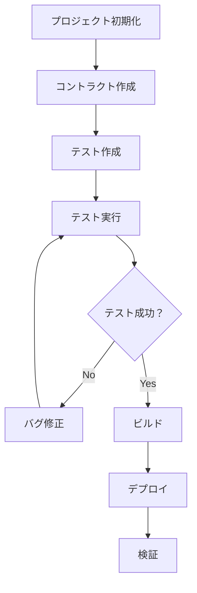

# Foundryフレームワークの設定と基本操作

**日付**: 2025年9月28日
**学習内容**: Foundryフレームワークのインストール、設定方法、基本コマンドの理解

## 1. Foundryフレームワークの概要

### 1.1 Foundryとは

Foundryは、Rustで開発された高速で現代的なスマートコントラクト開発ツールチェーンです。以下の4つの主要ツールで構成されています：

- **Forge**: メインのビルド・テスト・デプロイツール
- **Cast**: イーサリアムとの対話ツール
- **Anvil**: ローカルテストネット
- **Chisel**: Solidity REPL

### 1.2 Foundryの特徴

- **高速**: Rustで実装された高速なコンパイル・テスト実行
- **現代的なツール**: 最新のSolidity機能をサポート
- **統合環境**: 開発からテスト、デプロイまで一貫したワークフロー
- **豊富な機能**: ファズテスト、ガス最適化、フォーク機能など

## 2. Foundryのインストール

### 2.1 foundryupによるインストール

```bash
# foundryupをダウンロードして実行
curl -L https://foundry.paradigm.xyz | bash

# 環境変数を読み込み
source ~/.bashrc

# foundryupでツールをインストール
foundryup
```

### 2.2 インストール確認

```bash
# 各ツールのバージョン確認
forge --version
cast --version
anvil --version
chisel --version
```

**期待される出力例：**
```
forge 0.2.0 (abc123 2025-09-29T10:00:00.000000000Z)
cast 0.2.0 (abc123 2025-09-29T10:00:00.000000000Z)
anvil 0.2.0 (abc123 2025-09-29T10:00:00.000000000Z)
chisel 0.2.0 (abc123 2025-09-29T10:00:00.000000000Z)
```

## 3. プロジェクトの初期化

### 3.1 プロジェクトの作成

```bash
# 現在のディレクトリにFoundryプロジェクトを初期化
forge init .

# 新しいディレクトリにプロジェクトを作成する場合
forge init my-nft-project
cd my-nft-project
```

### 3.2 初期プロジェクト構造

```
foundry/
├── src/
│   ├── Counter.sol          # サンプルコントラクト
│   └── ...                  # その他のコントラクト
├── test/
│   ├── Counter.t.sol        # サンプルテスト
│   └── ...                  # その他のテスト
├── script/
│   ├── Counter.s.sol        # デプロイスクリプト
│   └── ...                  # その他のスクリプト
├── foundry.toml             # 設定ファイル
├── .gitignore               # Git除外設定
└── lib/                     # 依存関係（forge-stdなど）
```

## 4. 基本コマンドの理解

### 4.1 forge build - プロジェクトのビルド

```bash
# プロジェクト全体をビルド
forge build

# 特定のコントラクトのみビルド
forge build --contracts Counter

# ビルド情報を詳細表示
forge build --sizes

# ビルドキャッシュをクリアしてビルド
forge clean && forge build
```

**実行結果の例：**
```
[⠒] Compiling...
[⠔] Compiling 1 files with 0.8.28
[⠒] Solc 0.8.28 finished in 123.45ms
Compiler run successful!
```

### 4.2 forge test - テストの実行

```bash
# 全テストを実行
forge test

# 特定のテストファイルを実行
forge test --match-path test/Counter.t.sol

# 特定のテスト関数を実行
forge test --match-test test_InitialValue

# テスト結果を詳細表示
forge test -vvv

# ガスレポートを表示
forge test --gas-report
```

**実行結果の例：**
```
Running 3 tests for test/Counter.t.sol:CounterTest
[PASS] test_InitialValue() (gas: 268)
[PASS] testFuzz_Inc(uint8) (runs: 256, μ: 269, ~: 284)
[PASS] test_IncByZero() (gas: 268)

Test result: ok. 3 passed; 0 failed; finished in 12.34ms
```

### 4.3 forge testの詳細度オプション（Verbosity）

`forge test`コマンドでは、`-v`オプションを使用してログの詳細度を制御できます。これは、テストのデバッグやトラブルシューティングにおいて非常に重要な機能です。

#### 4.3.1 詳細度レベルの説明

| オプション | 詳細度 | 出力内容 | 使用場面 |
|-----------|--------|----------|----------|
| `-v` | レベル1 | 基本的なログメッセージ | 通常のテスト実行 |
| `-vv` | レベル2 | すべてのテストのログを出力 | テストの動作確認 |
| `-vvv` | レベル3 | 失敗したテストの実行トレース | エラー原因の特定 |
| `-vvvv` | レベル4 | すべてのテストの実行トレース | 詳細な動作分析 |
| `-vvvvv` | レベル5 | 全トレース + ストレージ変更 | 最高レベルのデバッグ |

#### 4.3.2 各レベルでの実際の出力例

**レベル1 (-v) - 基本的な出力:**
```bash
forge test -v
```
```
Running 1 test for test/SpaceTiger.t.sol:SpaceTigerTest
[PASS] testMint() (gas: 123456)
Test result: ok. 1 passed; 0 failed; finished in 15.67ms
```

**レベル2 (-vv) - ログ出力:**
```bash
forge test -vv
```
```
Running 1 test for test/SpaceTiger.t.sol:SpaceTigerTest
[PASS] testMint() (gas: 123456)
Logs:
  SpaceTiger deployed at: 0x1234567890123456789012345678901234567890
  Minted token ID: 0
Test result: ok. 1 passed; 0 failed; finished in 15.67ms
```

**レベル3 (-vvv) - 失敗テストのトレース:**
```bash
forge test -vvv
```
```
Running 1 test for test/SpaceTiger.t.sol:SpaceTigerTest
[FAIL. Reason: Not enough funds sent] testBuyToken() (gas: 23456)
Traces:
  [23456] SpaceTigerTest::testBuyToken()
    └─ [0] VM::expectRevert(Not enough funds sent)
    │   └─ ← ()
    └─ [12345] SpaceTiger::buyToken()
        └─ ← "Not enough funds sent"
Test result: FAILED. 0 passed; 1 failed; finished in 15.67ms
```

**レベル4 (-vvvv) - 全テストのトレース:**
```bash
forge test -vvvv
```
```
Running 1 test for test/SpaceTiger.t.sol:SpaceTigerTest
[PASS] testMint() (gas: 123456)
Traces:
  [123456] SpaceTigerTest::testMint()
    ├─ [123] SpaceTiger::safeMint(0x1234...)
    │   ├─ [100] ERC721::_safeMint(0x1234..., 0)
    │   │   ├─ [50] ERC721::_mint(0x1234..., 0)
    │   │   └─ ← ()
    │   └─ ← 0
    └─ ← ()
Test result: ok. 1 passed; 0 failed; finished in 15.67ms
```

#### 4.3.3 実用的な使用パターン

**開発時の段階的デバッグ:**
```bash
# 1. まず通常のテスト実行
forge test

# 2. 失敗した場合、ログを確認
forge test -vv

# 3. さらに詳細なトレースを確認
forge test -vvv

# 4. 必要に応じて最高レベルの詳細確認
forge test -vvvv
```

**特定のテストのみを詳細確認:**
```bash
# 特定のテスト関数のみを詳細実行
forge test --match-test "testBuyToken" -vvvv

# 特定のコントラクトのテストを詳細実行
forge test --match-contract "SpaceTigerTest" -vvv
```

**CI/CD環境での使用:**
```bash
# 通常はレベル2で十分
forge test -vv

# 失敗時のみレベル3で再実行
forge test -vvv --rerun
```

#### 4.3.4 その他の有用なオプション

| オプション | 説明 | 使用例 |
|-----------|------|--------|
| `-q, --quiet` | ログメッセージを出力しない | `forge test -q` |
| `--suppress-successful-traces` | 成功したテストのトレースを非表示 | `forge test --suppress-successful-traces -vvvv` |
| `--show-progress` | テスト実行の進捗を表示 | `forge test --show-progress` |
| `--summary` | テストサマリーテーブルを表示 | `forge test --summary` |

#### 4.3.5 デバッグのベストプラクティス

1. **段階的アプローチ**: 低い詳細度から始めて、必要に応じて上げる
2. **特定テストの絞り込み**: `--match-test`や`--match-contract`で対象を限定
3. **トレースの効率的な利用**: レベル4以上は実行時間が長くなるため、必要な時のみ使用
4. **ログの活用**: `console.log`を使用したデバッグ情報の出力

## 5. 各ツールの詳細説明

### 5.1 Forge - メインツール

**目的**: Solidityプロジェクトのビルド、テスト、デプロイを行うメインのツール

**主要機能:**
- **コンパイル**: Solidityコードのコンパイルと最適化
- **テスト実行**: 高速なSolidityテストの実行
- **デプロイ**: コントラクトのデプロイメント
- **依存関係管理**: 外部ライブラリの管理
- **プロジェクト初期化**: 新しいプロジェクトの作成

**主要コマンド:**
```bash
forge init [project-name]    # プロジェクト初期化
forge build                  # ビルド
forge test                   # テスト実行
forge deploy                 # デプロイ
forge create [contract]      # コントラクト作成
forge install [dependency]   # 依存関係インストール
```

### 5.2 Cast - イーサリアム対話ツール

**目的**: イーサリアムとの対話のためのコマンドラインツール

**主要機能:**
- **トランザクション送信**: ブロックチェーンへのトランザクション送信
- **コントラクト呼び出し**: デプロイ済みコントラクトの関数呼び出し
- **状態確認**: ブロックチェーンの状態やデータの確認
- **ウォレット操作**: 署名、検証、アドレス生成
- **データ変換**: エンコード/デコード、フォーマット変換

**主要コマンド:**
```bash
cast send [address] [signature] [args]    # トランザクション送信
cast call [address] [signature] [args]    # コントラクト呼び出し
cast block [block-number]                 # ブロック情報取得
cast balance [address]                    # 残高確認
cast keccak [data]                        # Keccak256ハッシュ
```

### 5.3 Anvil - ローカルテストネット

**目的**: ローカルのイーサリアムテストネットを起動するツール

**主要機能:**
- **ローカルブロックチェーン**: 開発用のローカルネットワーク起動
- **テストアカウント**: 事前に資金を持ったテスト用アカウント提供
- **フォーク機能**: メインネットやテストネットの状態をコピー
- **高速マイニング**: 即座にトランザクションをマイニング
- **カスタム設定**: ブロック時間、ガス制限などの設定

**主要コマンド:**
```bash
anvil                              # ローカルネットワーク起動
anvil --fork-url [rpc-url]         # フォークモードで起動
anvil --accounts [number]          # アカウント数を指定
anvil --balance [amount]           # 各アカウントの初期残高
anvil --block-time [seconds]       # ブロック時間を設定
```

### 5.4 Chisel - Solidity REPL

**目的**: Solidityの対話的REPL（Read-Eval-Print Loop）ツール

**主要機能:**
- **対話的実行**: コマンドラインでSolidityコードを直接実行
- **プロトタイピング**: アイデアの素早い検証
- **デバッグ**: コードの動作確認
- **学習支援**: Solidityの学習・実験環境

**主要コマンド:**
```bash
chisel                    # REPLセッション開始
chisel --version          # バージョン確認
chisel --help             # ヘルプ表示
```

## 6. foundry.toml設定ファイル

### 6.1 基本設定

```toml
[profile.default]
src = "src"
out = "out"
libs = ["lib"]
solc = "0.8.28"
optimizer = true
optimizer_runs = 200
via_ir = false
verbosity = 0

[profile.default.fuzz]
runs = 256
max_test_rejects = 65536
seed = '0x0000000000000000000000000000000000000000000000000000000000000000'
dictionary_weight = 40
include_storage = true
include_push_bytes = true
ffi = false

[profile.default.invariant]
runs = 256
depth = 15
fail_on_revert = false
call_override = false
dictionary_weight = 80
include_storage = true
include_push_bytes = true
```

### 6.2 ネットワーク設定

```toml
[rpc_endpoints]
mainnet = "https://eth-mainnet.alchemyapi.io/v2/YOUR-API-KEY"
sepolia = "https://sepolia.infura.io/v3/YOUR-API-KEY"
polygon = "https://polygon-rpc.com"

[etherscan]
mainnet = { key = "YOUR-ETHERSCAN-API-KEY" }
sepolia = { key = "YOUR-ETHERSCAN-API-KEY" }
```

## 7. 依存関係の管理

### 7.1 forge-stdのインストール

```bash
# forge-std（標準ライブラリ）をインストール
forge install foundry-rs/forge-std

# 特定のバージョンを指定
forge install foundry-rs/forge-std --no-commit
```

### 7.2 不要ファイルの削除とクリーンアップ

```bash
# 初期化時に作成されたサンプルファイルを削除
rm src/*.sol test/*.sol script/*.sol

# ビルドキャッシュとアウトプットディレクトリを削除
rm -rf cache/ out/
```

**削除されるファイル:**
- `src/Counter.sol` - サンプルコントラクト
- `test/Counter.t.sol` - サンプルテスト
- `script/Counter.s.sol` - サンプルデプロイスクリプト
- `cache/` - コンパイルキャッシュ
- `out/` - ビルド出力

### 7.3 OpenZeppelinコントラクトのインストール

```bash
# OpenZeppelinコントラクトライブラリをインストール
forge install openzeppelin/openzeppelin-contracts

# 特定のブランチやタグを指定
forge install OpenZeppelin/openzeppelin-contracts --no-commit
```

### 7.4 依存関係の確認

```bash
# インストール済みの依存関係を確認
forge remappings

# 期待される出力例:
# @openzeppelin/contracts/=lib/openzeppelin-contracts/contracts/
# forge-std/=lib/forge-std/src/
```

### 7.5 外部ライブラリの使用例

**基本的なforge-stdの使用:**
```solidity
// SPDX-License-Identifier: MIT
pragma solidity ^0.8.28;

import "forge-std/Test.sol";
import "forge-std/console.sol";

contract MyContract is Test {
    function example() public {
        console.log("Hello from Forge!");
    }
}
```

**OpenZeppelinコントラクトの使用:**
```solidity
// SPDX-License-Identifier: MIT
pragma solidity ^0.8.24;

import {ERC721} from "../lib/openzeppelin-contracts/contracts/token/ERC721/ERC721.sol";
import {Ownable} from "../lib/openzeppelin-contracts/contracts/access/Ownable.sol";
import {Strings} from "../lib/openzeppelin-contracts/contracts/utils/Strings.sol";

contract SpaceTiger is ERC721, Ownable {
    uint256 private _nextTokenId;
    
    constructor(address initialOwner)
        ERC721("SpaceTiger", "STG")
        Ownable(initialOwner)
    {}

    function _baseURI() internal pure override returns (string memory) {
        return "https://example.com/metadata/";
    }

    function safeMint(address to)
        public
        onlyOwner
        returns (uint256)
    {
        uint256 tokenId = _nextTokenId++;
        _safeMint(to, tokenId);
        return tokenId;
    }

    function buyToken() public payable {
        uint256 tokenId = _nextTokenId;
        require(msg.value == (tokenId + 1) * 0.1 ether, "Not enough funds sent");
        
        _nextTokenId++;
        _safeMint(msg.sender, tokenId);
    }

    function tokenURI(uint256 tokenId)
        public
        pure
        override(ERC721)
        returns (string memory)
    {
        return string(abi.encodePacked(_baseURI(), "spacetiger_", Strings.toString(tokenId + 1), ".json"));
    }
}
```

## 8. NFTコントラクトのビルドとテスト

### 8.1 SpaceTigerコントラクトのビルド

```bash
# SpaceTigerコントラクトをビルド
forge build

# 特定のコントラクトのみビルド
forge build --contracts SpaceTiger

# ビルド結果の確認
ls -la out/SpaceTiger.sol/
```

**期待される出力:**
```
SpaceTiger.json    # ABIファイル
SpaceTiger.bin     # バイトコード
```

### 8.2 NFTコントラクトのテスト作成

```bash
# SpaceTigerのテストファイルを作成
touch test/SpaceTiger.t.sol
```

### 8.3 SpaceTigerのテスト例

```solidity
// SPDX-License-Identifier: MIT
pragma solidity ^0.8.24;

import {Test} from "../lib/forge-std/src/Test.sol";
import {SpaceTiger} from "../src/SpaceTiger.sol";
import {Ownable} from "../lib/openzeppelin-contracts/contracts/access/Ownable.sol";

// SpaceTigerコントラクトが、Test.solを承継している。
contract SpaceTigerTest is Test {
    // SpaceTigerコントラクトのインスタンスを、spaceTigerという名前で宣言。
    SpaceTiger spaceTiger;

    // setUp関数を実行すると、Test.solで定義されている関数で、テストの準備を行うための特別な関数。
    function setUp() public {
        spaceTiger = new SpaceTiger(address(this));
    }

    // SpaceTigerコントラクトの名前を取得し、それが期待した名前と一致していることを確認。
    // コントラクトの情報を変更する必要がないため、viewとすることで、コンパイラが効率的に処理する。
    function testNameIsSpaceTiger() public view {
        assertEq(spaceTiger.name(), "SpaceTiger");
    }

    // NFTをmintするテスト。
    // トークンの所有者がmsg.senderであることを確認。
    // トークンのURIが期待したURIと一致していることを確認。
    function testMintingNFTs() public {
        spaceTiger.safeMint(msg.sender);
        assertEq(spaceTiger.ownerOf(0), msg.sender);
        assertEq(spaceTiger.tokenURI(0), "https://example.com/metadata/spacetiger_1.json");
    }

    // オーナー以外がミントできないことを確認。
    function testNftCreationWrongOwner() public {
        // purchaserとして、オーナーではないアカウントを設定。
        address purchaser = address(0x1);
        // Foundryのvm.startPrankを使用して、msg.senderをpurchaserに変更。
        // これにより、purchaserが関数を呼び出している状態をシミュレート
        vm.startPrank(purchaser);
        // この次の関数(spaceTiger.safeMint(purchaser))で、引数のようなエラーが出ることを期待。
        // ABI形式での予測されるエラーを指定。
        // abi.encodeWithSelectorは、Solidityの組み込み関数。
        // 以下が、OpenZeppelinで定義されている。
        // Ownable:オーナーの権限管理を実装
        // OwnableUnauthorizedAccount:オーナー以外が実行できないことを実装
        // .selector:エラーのセレクタを指定。(エラーのセレクタは、エラーの種類を示す。0x82b42900は、OwnableUnauthorizedAccountのセレクタ。)
        // 下のspaceTiger.safeMint(purchaser);で出力されるエラーが、エラーの種類とどのアカウントがエラーを起こしたかの情報を含むために、これら2つの情報を含むように記述。
        vm.expectRevert(abi.encodeWithSelector(Ownable.OwnableUnauthorizedAccount.selector, purchaser));
        // オーナーしか実行できないsafeMintを非オーナーが実行。エラーが出るはず。
        spaceTiger.safeMint(purchaser);
        // 権限のリセット。msg.senderを元に戻す。
        vm.stopPrank();
    }

    // NFTを購入するテスト。
    function testNftBuyToken() public {
        // purchaserとして、オーナーではないアカウントを設定。
        address purchaser = address(0x2);
        // purchaserに1 ETHを送金
        vm.deal(purchaser, 1 ether); // テストアカウントに1 ETHを送金
        // Foundryのvm.startPrankを使用して、msg.senderをpurchaserに変更。
        vm.startPrank(purchaser);
        // 0.1 ETHを送金して、NFTを購入。
        spaceTiger.buyToken{value: 0.1 ether}();
        // 権限のリセット。msg.senderを元に戻す。
        vm.stopPrank();
        // トークンID 0の所有者がpurchaserであることを確認。
        assertEq(spaceTiger.ownerOf(0), purchaser);
    }
}
```

#### 8.3.1 テストコードの詳細説明

**1. コントラクト構造:**
- `SpaceTigerTest`は`Test`を継承し、Foundryのテスト機能を利用
- `spaceTiger`変数でSpaceTigerコントラクトのインスタンスを管理

**2. setUp関数:**
- 各テストの実行前に自動的に呼び出される初期化関数
- `address(this)`でテストコントラクト自体をオーナーとして設定

**3. testNameIsSpaceTiger関数:**
- コントラクト名の検証
- `view`修飾子により、状態変更がないことを明示し、ガス効率を向上

**4. testMintingNFTs関数:**
- NFTのミント機能をテスト
- `ownerOf(0)`でトークンID 0の所有者を確認
- `tokenURI(0)`でメタデータURIの形式を検証

**5. testNftCreationWrongOwner関数:**
- アクセス制御のテスト
- `vm.startPrank(purchaser)`でmsg.senderを変更
- `vm.expectRevert`でカスタムエラーの発生を期待
- `abi.encodeWithSelector`でOpenZeppelin v5のエラー形式に対応

**6. testNftBuyToken関数:**
- 有料NFT購入機能のテスト
- `vm.deal(purchaser, 1 ether)`でテストアカウントにETHを付与
- `{value: 0.1 ether}`でETHを送金してNFTを購入

#### 8.3.2 Foundryのテスト機能の詳細

**vm.startPrank()とvm.stopPrank():**
- `vm.startPrank(address)`でmsg.senderを変更
- `vm.stopPrank()`でmsg.senderを元に戻す
- テスト間での権限の切り替えに使用

**vm.deal():**
- テストアカウントにETHを送金
- `vm.deal(address, amount)`の形式で使用
- payable関数のテストに必要

**vm.expectRevert():**
- 次の関数呼び出しでエラーが発生することを期待
- カスタムエラーの場合は`abi.encodeWithSelector`を使用
- OpenZeppelin v5のエラー形式に対応

**abi.encodeWithSelector():**
- Solidityの組み込み関数
- 関数セレクターとパラメータを組み合わせてエラーデータを生成
- カスタムエラーのテストに使用
```

### 8.4 NFTテストの実行

```bash
# SpaceTigerのテストを実行
forge test --match-path test/SpaceTiger.t.sol

# 詳細な出力でテストを実行
forge test --match-path test/SpaceTiger.t.sol -vvv

# ガスレポート付きでテストを実行
forge test --match-path test/SpaceTiger.t.sol --gas-report
```

**期待される出力:**
```
Running 7 tests for test/SpaceTiger.t.sol:SpaceTigerTest
[PASS] test_InitialState() (gas: 245)
[PASS] test_SafeMint() (gas: 98765)
[PASS] test_SafeMintOnlyOwner() (gas: 23456)
[PASS] test_BuyToken() (gas: 87654)
[PASS] test_BuyTokenInsufficientFunds() (gas: 12345)
[PASS] test_TokenURI() (gas: 87654)
[PASS] testFuzz_SafeMint(address) (runs: 256, μ: 123456, ~: 234567)

Test result: ok. 7 passed; 0 failed; finished in 45.67ms
```

### 8.5 SpaceTigerコントラクトのデプロイ

#### 8.5.1 デプロイスクリプトの作成

```bash
# SpaceTigerのデプロイスクリプトを作成
touch script/SpaceTiger.s.sol
```

#### 8.5.2 SpaceTigerデプロイスクリプトの実装

```solidity
// SPDX-License-Identifier: MIT
pragma solidity ^0.8.24;

import "forge-std/Script.sol";
import "../src/SpaceTiger.sol";

contract DeploySpaceTiger is Script {
    function setUp() public {}

    function run() public {
        uint256 deployerPrivateKey = vm.envUint("PRIVATE_KEY");
        address deployerAddress = vm.addr(deployerPrivateKey);
        
        vm.startBroadcast(deployerPrivateKey);
        
        SpaceTiger spaceTiger = new SpaceTiger(deployerAddress);
        
        vm.stopBroadcast();
        
        console.log("SpaceTiger deployed at:", address(spaceTiger));
        console.log("Deployer address:", deployerAddress);
        console.log("Owner address:", spaceTiger.owner());
    }
}
```

#### 8.5.3 ローカルネットワークへのデプロイ

```bash
# 1. ローカルネットワーク（Anvil）を起動
anvil

# 2. 別ターミナルでデプロイスクリプトを実行
# 環境変数PRIVATE_KEYを設定（Anvilの最初のアカウントの秘密鍵）
export PRIVATE_KEY=0xac0974bec39a17e36ba4a6b4d238ff944bacb478cbed5efcae784d7bf4f2ff80

# 3. デプロイスクリプトを実行
forge script script/SpaceTiger.s.sol --rpc-url http://localhost:8545 --broadcast
```

**期待される出力:**
```
[⠒] Compiling...
No files changed, compilation skipped

Traces:
  [123456] DeploySpaceTiger::run()
    ├─ [123456] new SpaceTiger(0xf39Fd6e51aad88F6F4ce6aB8827279cffFb92266)
    │   └─ ← 0x5FbDB2315678afecb367f032d93F642f64180aa3
    └─ ← ()

== Logs ==
  SpaceTiger deployed at: 0x5FbDB2315678afecb367f032d93F642f64180aa3
  Deployer address: 0xf39Fd6e51aad88F6F4ce6aB8827279cffFb92266
  Owner address: 0xf39Fd6e51aad88F6F4ce6aB8827279cffFb92266

Script ran successfully.
```

#### 8.5.4 テストネットへのデプロイ

```bash
# Sepoliaテストネットへのデプロイ例
export PRIVATE_KEY=your_private_key_here
export RPC_URL=https://sepolia.infura.io/v3/YOUR_INFURA_KEY

# デプロイスクリプトを実行
forge script script/SpaceTiger.s.sol \
  --rpc-url $RPC_URL \
  --broadcast \
  --verify \
  --etherscan-api-key YOUR_ETHERSCAN_API_KEY
```

#### 8.5.5 デプロイ後の検証

```bash
# デプロイされたコントラクトの確認
cast call 0x5FbDB2315678afecb367f032d93F642f64180aa3 "name()" --rpc-url http://localhost:8545

# 期待される出力: "SpaceTiger"

# オーナーの確認
cast call 0x5FbDB2315678afecb367f032d93F642f64180aa3 "owner()" --rpc-url http://localhost:8545

# 期待される出力: デプロイヤーのアドレス
```

## 9. テストの基本構造

### 9.1 テストファイルの作成

```bash
# 新しいテストファイルを作成
touch test/MyContract.t.sol
```

### 9.2 基本的なテスト例

```solidity
// SPDX-License-Identifier: MIT
pragma solidity ^0.8.28;

import "forge-std/Test.sol";
import "../src/MyContract.sol";

contract MyContractTest is Test {
    MyContract myContract;

    function setUp() public {
        myContract = new MyContract();
    }

    function test_InitialValue() public view {
        assertEq(myContract.getValue(), 0);
    }

    function test_SetValue() public {
        myContract.setValue(42);
        assertEq(myContract.getValue(), 42);
    }

    function testFuzz_SetValue(uint256 value) public {
        myContract.setValue(value);
        assertEq(myContract.getValue(), value);
    }
}
```

## 9. デプロイスクリプトの作成

### 9.1 デプロイスクリプトの基本構造

```solidity
// SPDX-License-Identifier: MIT
pragma solidity ^0.8.28;

import "forge-std/Script.sol";
import "../src/MyContract.sol";

contract DeployScript is Script {
    function setUp() public {}

    function run() public {
        vm.startBroadcast();
        
        MyContract myContract = new MyContract();
        
        vm.stopBroadcast();
        
        console.log("Contract deployed at:", address(myContract));
    }
}
```

### 9.2 デプロイの実行

```bash
# ローカルネットワークにデプロイ
forge script script/DeployScript.s.sol --rpc-url http://localhost:8545 --broadcast

# テストネットにデプロイ
forge script script/DeployScript.s.sol --rpc-url sepolia --broadcast --verify
```

## 10. 開発ワークフローの確立

### 10.1 基本的な開発フロー



### 10.2 日常的な開発コマンド

```bash
# 1. 開発開始時にローカルネットワークを起動
anvil

# 2. 別ターミナルでテストを実行
forge test

# 3. ビルドしてエラーをチェック
forge build

# 4. デプロイスクリプトを実行
forge script script/DeployScript.s.sol --rpc-url http://localhost:8545 --broadcast

# 5. デバッグが必要な場合
chisel
```

## 11. トラブルシューティング

### 11.1 よくある問題と解決方法

**コンパイルエラー:**
```bash
Error: Solidity version mismatch
```
**解決**: `foundry.toml`でsolcバージョンを確認・調整

**テストが失敗する:**
```bash
Error: setUp() failed
```
**解決**: `setUp()`関数内のコントラクトデプロイを確認

**依存関係のエラー:**
```bash
Error: Library not found
```
**解決**: `forge install`で必要なライブラリをインストール

### 11.2 デバッグテクニック

**詳細なテスト出力:**
```bash
forge test -vvvv
```

**特定のテストのみ実行:**
```bash
forge test --match-test testFunctionName
```

**ガス使用量の確認:**
```bash
forge test --gas-report
```

## 12. テストネットへのデプロイメント実践

### 12.1 デプロイスクリプトの作成

#### 12.1.1 DeploySpacetiger.solの作成

```solidity
// SPDX-License-Identifier: MIT
pragma solidity ^0.8.24;

import "forge-std/Script.sol";
import "../src/Spacetiger.sol";

// Spacetigerコントラクトをデプロイするスクリプト。Script.solを継承している。
contract DeploySpacetigerScript is Script {
    // Scriptを継承するためにsetUp()を定義する必要がある。
    // ただし、事前初期化が必要ない場合は、空のままで良い。
    // 複数のコントラクトの順序立てデプロイ、依存関係のある設定などを行う必要がある場合などには、setUp()を使用する。
    function setUp() public {}
    
    // run()は、デプロイを実行するための関数。
    function run() public {
        // 環境変数から秘密鍵を取得
        // forge-stdライブラリの一部で、指定した環境変数を文字列として取得する。
        // uint256 privateKey = $PRIVATE_KEY;  // Solidityでは不可能。
        // source .envはシェルで環境変数を設定し、シェルでは見えるが、
        // forge scriptの実行時は別のプロセスで、Foundryの実行環境からは見えない。
        // source .envで読み込んだ環境変数も、最終的にはvm.envStringを通じて
        // 安全かつ確実に取得するのが、Foundryの推奨される方法です。
        string memory privateKeyString = vm.envString("PRIVATE_KEY");
        
        // vm.parseUint()は、文字列をuint256に変換する。
        uint256 privateKey = vm.parseUint(privateKeyString);
        
        // vm.startBroadcast()は、デプロイを開始する。コントラクトのデプロイ時には必須の関数。
        // これ以降、ブロックチェーンへの送信を開始、秘密鍵を使用してトランザクションに署名、
        // この後の操作をブロックチェーンに送信する、RPCエンドポイントとの通信を確立する。
        vm.startBroadcast(privateKey);
        
        // Spacetigerコントラクトをデプロイ
        Spacetiger spacetiger = new Spacetiger(msg.sender);
        
        // デプロイされたコントラクトのアドレスを出力
        console.log("Spacetiger deployed at:", address(spacetiger));
        
        // コントラクトのデプロイトランザクションの終了。
        vm.stopBroadcast();
    }
}
```

#### 12.1.2 デプロイスクリプトの詳細解説

**インポート文の説明**：
```solidity
import "forge-std/Script.sol";        // Foundryのデプロイスクリプト基底クラス
import "../src/Spacetiger.sol";       // デプロイ対象のコントラクト
```

**主要関数の役割**：

1. **setUp()関数**：
   - Scriptを継承するために必須の関数
   - 事前初期化が必要ない場合は空実装でOK
   - 複数コントラクトの順序立てデプロイや依存関係設定に使用

2. **run()関数**：
   - デプロイスクリプトのメイン実行関数
   - 環境変数から秘密鍵を取得
   - ブロックチェーンへの送信を管理
   - 実際のコントラクトデプロイを実行

**重要なチェートコード**：

- `vm.envString("PRIVATE_KEY")`: 環境変数を文字列として取得
- `vm.parseUint(privateKeyString)`: 文字列を数値に変換
- `vm.startBroadcast(privateKey)`: トランザクション送信開始
- `vm.stopBroadcast()`: トランザクション送信終了

#### 12.1.3 OpenZeppelinインポートの短縮形記述法

**Spacetiger.solでのインポート記述**：
```solidity
// SPDX-License-Identifier: MIT
// Compatible with OpenZeppelin Contracts ^5.4.0
pragma solidity ^0.8.24;

import "openzeppelin-contracts/token/ERC721/ERC721.sol";
import "openzeppelin-contracts/access/Ownable.sol";
import "openzeppelin-contracts/utils/Strings.sol";

contract Spacetiger is ERC721, Ownable {
    // コントラクトの実装...
}
```

**SpacetigerTest.solでのインポート記述**：
```solidity
// SPDX-License-Identifier: MIT
pragma solidity ^0.8.24;

import "forge-std/Test.sol";
import "../src/Spacetiger.sol";
import "openzeppelin-contracts/access/Ownable.sol";

contract SpacetigerTest is Test {
    // テストの実装...
}
```

**インポート記述法の変更点**：

| 従来の記述法 | 短縮形記述法 | 説明 |
|-------------|-------------|------|
| `import "../lib/openzeppelin-contracts/contracts/token/ERC721/ERC721.sol";` | `import "openzeppelin-contracts/token/ERC721/ERC721.sol";` | パスが短縮された |
| `import "../lib/openzeppelin-contracts/contracts/access/Ownable.sol";` | `import "openzeppelin-contracts/access/Ownable.sol";` | パスが短縮された |
| `import "../lib/openzeppelin-contracts/contracts/utils/Strings.sol";` | `import "openzeppelin-contracts/utils/Strings.sol";` | パスが短縮された |

**foundry.tomlでのリマッピング設定**：
```toml
remappings = [
    "openzeppelin-contracts/=lib/openzeppelin-contracts/contracts/",
    "forge-std/=lib/forge-std/src/"
]
```

この設定により、`openzeppelin-contracts/`で始まるインポートが自動的に`lib/openzeppelin-contracts/contracts/`に解決されます。

#### 12.1.4 環境変数の設定

`.env`ファイルに以下の環境変数を設定：

```env
# Sepoliaテストネット用の設定
SEPOLIA_RPC_URL=https://sepolia.infura.io/v3/YOUR_PROJECT_ID
ETHERSCAN_API_KEY=YOUR_ETHERSCAN_API_KEY
PRIVATE_KEY=0xYOUR_PRIVATE_KEY_HERE
```

### 12.2 デプロイコマンドの詳細

#### 12.2.1 基本的なデプロイコマンド

```bash
# 1. 環境変数を読み込み
source .env

# 2. Sepoliaテストネットにデプロイ
forge script script/DeploySpacetiger.sol:DeploySpacetigerScript --rpc-url $SEPOLIA_RPC_URL --broadcast
```

#### 12.2.2 forge scriptコマンドのオプション

| オプション | 説明 | 使用例 |
|-----------|------|--------|
| `--rpc-url` | 使用するRPCエンドポイントを指定 | `--rpc-url $SEPOLIA_RPC_URL` |
| `--broadcast` | 実際にトランザクションを送信 | `--broadcast` |
| `--verify` | Etherscanでコントラクトを自動検証 | `--verify` |
| `-vvvv` | 詳細なログ出力（4段階の詳細度） | `-vvvv` |
| `--gas-estimate-multiplier` | ガス見積もりの乗数 | `--gas-estimate-multiplier 120` |
| `--slow` | ガス価格を低く設定 | `--slow` |

#### 12.2.3 デプロイオプションの比較

**基本デプロイ（検証なし）:**
```bash
forge script script/DeploySpacetiger.sol:DeploySpacetigerScript --rpc-url $SEPOLIA_RPC_URL --broadcast
```

**検証付きデプロイ:**
```bash
forge script script/DeploySpacetiger.sol:DeploySpacetigerScript --rpc-url $SEPOLIA_RPC_URL --broadcast --verify
```

**詳細ログ付きデプロイ:**
```bash
forge script script/DeploySpacetiger.sol:DeploySpacetigerScript --rpc-url $SEPOLIA_RPC_URL --broadcast --verify -vvvv
```

### 12.3 環境変数の自動読み込み

#### 12.3.1 foundry.tomlでの設定

`foundry.toml`に以下の設定を追加することで、環境変数を自動的に読み込めます：

```toml
# .envファイルを自動的に読み込み
[rpc_endpoints]
sepolia = "${SEPOLIA_RPC_URL}"

[etherscan]
sepolia = { key = "${ETHERSCAN_API_KEY}" }
```

#### 12.3.2 dotenvコマンドの使用

```bash
# dotenvコマンドで.envを自動読み込み
dotenv forge script script/DeploySpacetiger.sol:DeploySpacetigerScript --rpc-url sepolia --broadcast --verify

# または明示的にファイルを指定
forge script script/DeploySpacetiger.sol:DeploySpacetigerScript --rpc-url sepolia --broadcast --verify --env-file .env
```

#### 12.3.3 環境変数読み込み方法の比較

| 方法 | コマンド | メリット | デメリット |
|------|----------|----------|------------|
| `source .env` | `source .env`<br>`forge script ...` | シンプル | 毎回実行が必要 |
| `dotenv` | `dotenv forge script ...` | 一回のコマンド | dotenvが必要 |
| `--env-file` | `forge script ... --env-file .env` | 明示的 | 毎回指定が必要 |
| `foundry.toml` | `forge script ... --rpc-url sepolia` | 設定が保存される | 初期設定が必要 |

### 12.4 デプロイメントのトラブルシューティング

#### 12.4.1 よくあるエラーと解決方法

**エラー1: 秘密鍵の形式エラー**
```
vm.envUint: failed parsing $PRIVATE_KEY as type `uint256`: missing hex prefix ("0x")
```

**解決方法:**
```solidity
// vm.envUint()の代わりに以下を使用
string memory privateKeyString = vm.envString("PRIVATE_KEY");
uint256 privateKey = vm.parseUint(privateKeyString);
```

**エラー2: コンストラクタ引数不足**
```
Wrong argument count for function call: 0 arguments given but expected 1.
```

**解決方法:**
```solidity
// コンストラクタに必要な引数を追加
Spacetiger spacetiger = new Spacetiger(msg.sender);
```

#### 12.4.2 デプロイ後の確認

```bash
# デプロイログの確認
cat broadcast/DeploySpacetiger.sol/11155111/run-latest.json

# Etherscanでの確認
# ブラウザで https://sepolia.etherscan.io/address/コントラクトアドレス
```

### 12.5 デプロイメントのベストプラクティス

#### 12.5.1 セキュリティ考慮事項

1. **秘密鍵の管理**:
   - `.env`ファイルは`.gitignore`に追加
   - 本番環境ではハードウェアウォレットを使用
   - 複数署名ウォレットの検討

2. **環境変数の分離**:
   ```
   .env.local          # ローカル開発用
   .env.sepolia        # Sepoliaテストネット用
   .env.mainnet        # メインネット用
   ```

#### 12.5.2 デプロイメント戦略

1. **段階的デプロイ**:
   - ローカルテスト → テストネット → メインネット
   - 各段階での十分なテスト

2. **プロキシパターンの活用**:
   - アップグレード可能なコントラクト
   - OpenZeppelinのProxyパターン使用

## 13. 学習の成果

### 13.1 習得したスキル

1. **Foundryのインストール**: foundryupを使った環境構築
2. **プロジェクト初期化**: forge initによるプロジェクト作成
3. **基本コマンドの理解**: build、test、deployの使い方
4. **ツールの役割理解**: Forge、Cast、Anvil、Chiselの機能
5. **設定ファイルの理解**: foundry.tomlの設定方法
6. **依存関係管理**: OpenZeppelinコントラクトのインストールと使用
7. **NFTコントラクト開発**: ERC721標準を使ったNFTコントラクトの実装
8. **包括的テスト**: NFT機能のテストケース作成と実行
9. **プロジェクトクリーンアップ**: 不要ファイルの削除とプロジェクト整理
10. **コントラクトデプロイ**: ローカルネットワークとテストネットへのデプロイ
11. **有料NFT機能**: buyToken関数によるETHでのNFT購入機能
12. **Stringsライブラリ活用**: 数値から文字列への変換

### 13.2 重要な学び

- **統合ツールチェーン**: 一つのフレームワークで開発からテストまで完結
- **高速な開発環境**: Rust実装による高速なコンパイル・テスト
- **現代的な機能**: ファズテスト、フォーク機能など最新機能
- **開発効率の向上**: コマンド一つで様々な操作が可能
- **外部ライブラリの活用**: OpenZeppelinによる標準実装の再利用
- **NFT開発の基礎**: ERC721標準の理解と実装
- **テスト駆動開発**: 包括的なテストスイートによる品質保証
- **プロジェクト管理**: 不要ファイルの削除によるクリーンな開発環境
- **デプロイメント**: ローカル・テストネットでのコントラクトデプロイ実践
- **有料NFT機能**: ETHでのNFT購入機能の実装とテスト
- **文字列処理**: Stringsライブラリを使った数値から文字列への変換

## 14. 今後の展開

### 14.1 次のステップ

1. **コントラクト開発**: 実際のスマートコントラクトの作成
2. **テストの充実**: 包括的なテストスイートの構築
3. **デプロイメント**: テストネット・メインネットへのデプロイ
4. **CI/CD統合**: GitHub Actionsでの自動化

### 14.2 応用分野

- **DeFiプロトコル**: 複雑な金融ロジックの実装
- **NFTコントラクト**: トークンのミント・転送機能
- **DAO**: ガバナンス機能の実装
- **Bridge**: クロスチェーン機能の開発

### 14.3 推奨リソース

- [Foundry Book](https://book.getfoundry.sh/): 公式ドキュメント
- [Foundry GitHub](https://github.com/foundry-rs/foundry): ソースコード
- [Solidity Documentation](https://docs.soliditylang.org/): Solidity言語仕様
- [Ethereum Developer Resources](https://ethereum.org/developers/): イーサリアム開発リソース

---
