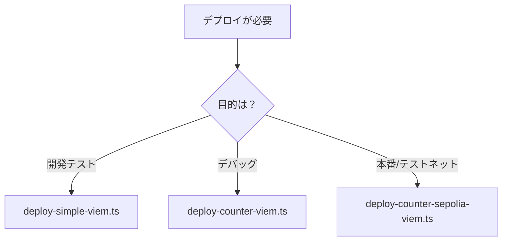

# ViemとEthersを使用したSepoliaテストネットへのデプロイ

**日付**: 2025年9月27日
**学習内容**: Counter.solのSepoliaテストネットへのデプロイ、Viemを使用したデプロイスクリプトの作成

## 1. デプロイスクリプトの概要

### 1.1 本日作成したデプロイスクリプト

今回、Counter.solをデプロイするために3種類のViemベースのデプロイスクリプトを作成しました。それぞれ異なる用途と複雑さのレベルを持っています。

**作成したスクリプト：**
- **deploy-simple-viem.ts**: 最小限のコードでデプロイ（4行）
- **deploy-counter-viem.ts**: 詳細情報付きのローカルデプロイ用
- **deploy-counter-sepolia-viem.ts**: Sepoliaテストネット用の本番環境向け

### 1.2 各スクリプトの特徴と用途

| スクリプト | 行数 | 用途 | 情報出力 | ネットワーク |
|----------|------|------|---------|------------|
| deploy-simple-viem.ts | 4行 | 開発時の高速テスト | 最小限 | ローカル |
| deploy-counter-viem.ts | 約40行 | ローカル開発・デバッグ | 詳細 | ローカル |
| deploy-counter-sepolia-viem.ts | 約50行 | テストネット・本番デプロイ | 完全 | Sepolia |

## 2. 各デプロイスクリプトの詳細

### 2.1 deploy-simple-viem.ts - 最もシンプルなバージョン

**コード：**
```typescript
import { network } from "hardhat";

async function main() {
  const { viem } = await network.connect({ network: "hardhatMainnet" });
  const counter = await viem.deployContract("Counter");
  console.log(`Counter deployed to: ${counter.address}`);
}

main().catch((error) => {
  console.error(error);
  process.exitCode = 1;
});
```

**特徴：**
- **最小限のコード**: わずか4行の実装部分
- **高速実行**: 必要最小限の処理のみ
- **用途**: 開発中の迅速なテスト、プロトタイピング
- **出力情報**: デプロイされたアドレスのみ

**実行コマンド：**
```bash
npx hardhat run scripts/deploy-simple-viem.ts
```

**実行結果：**
```
Counter deployed to: 0x5fbdb2315678afecb367f032d93f642f64180aa3
```

### 2.2 deploy-counter-viem.ts - ローカル開発用の詳細版

**コード：**
```typescript
import { network } from "hardhat";
import { parseEther } from "viem";

async function main() {
  console.log("Deploying Counter contract using Viem...");

  // ネットワークに接続
  const { viem } = await network.connect({ network: "hardhatMainnet" });

  // ウォレットクライアントを取得
  const [deployer] = await viem.getWalletClients();
  console.log("Deploying with account:", deployer.account.address);

  // パブリッククライアントを取得
  const publicClient = await viem.getPublicClient();

  // アカウントの残高を確認
  const balance = await publicClient.getBalance({
    address: deployer.account.address
  });
  console.log("Account balance:", parseEther(balance.toString()), "ETH");

  // コントラクトのデプロイ
  const counter = await viem.deployContract("Counter");
  console.log("✅ Counter deployed to:", counter.address);

  // デプロイ後の検証
  console.log("\nVerifying deployment...");
  const initialValue = await counter.read.x();
  console.log("Initial value of x:", initialValue.toString());

  // ネットワーク情報の表示
  const chainId = await publicClient.getChainId();
  console.log("Chain ID:", chainId);

  console.log("Deployment completed successfully!");
}

main().catch((error) => {
  console.error("Deployment failed:", error);
  process.exitCode = 1;
});
```

**特徴：**
- **詳細な情報出力**: アカウント情報、残高、初期値など
- **デプロイ検証**: コントラクトの初期状態を確認
- **エラーハンドリング**: 明確なエラーメッセージ
- **用途**: ローカル開発、デバッグ、学習

**実行結果：**
```
Deploying Counter contract using Viem...
Deploying with account: 0xf39fd6e51aad88f6f4ce6ab8827279cfffb92266
Account balance: 10000000000000000000000000000000000000000n ETH
✅ Counter deployed to: 0x5fbdb2315678afecb367f032d93f642f64180aa3

Verifying deployment...
Initial value of x: 0
Chain ID: 31337
Deployment completed successfully!
```

### 2.3 deploy-counter-sepolia-viem.ts - Sepoliaテストネット用

**コード：**
```typescript
import { network } from "hardhat";
import { formatEther } from "viem";

async function main() {
  console.log("Deploying Counter contract to Sepolia using Viem...");

  // Sepoliaネットワークに接続
  const { viem } = await network.connect({ network: "sepolia" });

  // ウォレットクライアントを取得
  const [deployer] = await viem.getWalletClients();
  console.log("Deploying with account:", deployer.account.address);

  // パブリッククライアントを取得
  const publicClient = await viem.getPublicClient();

  // アカウントの残高を確認
  const balance = await publicClient.getBalance({
    address: deployer.account.address
  });
  console.log("Account balance:", formatEther(balance), "ETH");

  // コントラクトのデプロイ
  console.log("Deploying Counter contract...");
  const counter = await viem.deployContract("Counter");

  console.log("Waiting for deployment confirmation...");
  const address = counter.address;

  console.log("✅ Counter deployed to:", address);

  // デプロイ後の検証
  console.log("\nVerifying deployment...");
  const initialValue = await counter.read.x();
  console.log("Initial value of x:", initialValue.toString());

  // ネットワーク情報の表示
  const chainId = await publicClient.getChainId();
  console.log("Network: Sepolia, Chain ID:", chainId);

  // Etherscanでの確認用URL
  if (chainId === 11155111) { // Sepolia Chain ID
    console.log("View on Etherscan: https://sepolia.etherscan.io/address/" + address);
  }

  console.log("Deployment completed successfully!");
}

main().catch((error) => {
  console.error("Deployment failed:", error);
  process.exitCode = 1;
});
```

**特徴：**
- **本番環境向け**: テストネットへの実際のデプロイ
- **Etherscanリンク**: デプロイ結果の確認URL
- **詳細なログ**: トランザクションの追跡が可能
- **エラー処理**: ネットワークエラーへの対応

**実行コマンド：**
```bash
npx hardhat run scripts/deploy-counter-sepolia-viem.ts --network sepolia
```

**実行結果：**
```
Deploying Counter contract to Sepolia using Viem...
Deploying with account: 0x4e482f3e77d3137e80e292d0b51d34e1026114bb
Account balance: 27.559969724422559063 ETH
Deploying Counter contract...
Waiting for deployment confirmation...
✅ Counter deployed to: 0xe49303d360e25d0efe16ec76dd432f015acbc363

Verifying deployment...
Initial value of x: 0
Network: Sepolia, Chain ID: 11155111
View on Etherscan: https://sepolia.etherscan.io/address/0xe49303d360e25d0efe16ec76dd432f015acbc363
Deployment completed successfully!
```

## 3. ローカルとSepoliaデプロイの設定の違い

### 3.1 必要な設定の比較

| 設定項目 | ローカル環境 | Sepoliaテストネット |
|---------|------------|------------------|
| ネットワーク名 | hardhatMainnet | sepolia |
| RPC URL | 不要（内蔵） | 必須（Infura/Alchemy等） |
| プライベートキー | 不要（自動生成） | 必須 |
| ETH残高 | 自動付与 | Faucetから取得必要 |
| ガス代 | 無料 | 必要（テストETH） |
| デプロイ時間 | 即座 | 10-30秒 |
| 永続性 | セッション終了まで | 永続的 |

### 3.2 環境変数の設定

**ローカル環境：**
- 環境変数の設定は不要
- Hardhatが自動的にローカルネットワークを起動

**Sepoliaテストネット：**

**.envファイルの作成：**
```bash
# .env
SEPOLIA_RPC_URL=https://sepolia.infura.io/v3/YOUR_PROJECT_ID
SEPOLIA_PRIVATE_KEY=0xYOUR_PRIVATE_KEY
```

**hardhat.config.tsの設定：**
```typescript
import * as dotenv from "dotenv";
dotenv.config();

const config: HardhatUserConfig = {
  networks: {
    sepolia: {
      type: "http",
      chainType: "l1",
      url: process.env.SEPOLIA_RPC_URL || configVariable("SEPOLIA_RPC_URL"),
      accounts: process.env.SEPOLIA_PRIVATE_KEY
        ? [process.env.SEPOLIA_PRIVATE_KEY]
        : [configVariable("SEPOLIA_PRIVATE_KEY")],
    },
  },
};
```

### 3.3 デプロイ前の準備

**ローカル環境の準備：**
```bash
# 1. コンパイルのみ
npx hardhat compile

# 2. すぐにデプロイ可能
npx hardhat run scripts/deploy-simple-viem.ts
```

**Sepoliaテストネットの準備：**
```bash
# 1. 環境変数の設定
cp .env.example .env
# .envファイルを編集

# 2. dotenvパッケージのインストール
npm install --save-dev dotenv

# 3. Sepolia ETHの取得
# Faucetサイトでテスト用ETHを取得

# 4. コンパイル
npx hardhat compile

# 5. デプロイ
npx hardhat run scripts/deploy-counter-sepolia-viem.ts --network sepolia
```

## 4. TypeScriptエラーの解決

### 4.1 遭遇したエラーと解決方法

**エラー1: ethersプロパティが存在しない**
```typescript
// エラーが出るコード
const Counter = await hre.ethers.getContractFactory("Counter");
```

**解決方法1: hardhat-ethersのインポート**
```typescript
import "@nomicfoundation/hardhat-ethers";
```

**解決方法2: 型アサーション**
```typescript
const Counter = await (hre as any).ethers.getContractFactory("Counter");
```

**エラー2: viemプロパティが存在しない**
```typescript
// エラーが出るコード
const counter = await hre.viem.deployContract("Counter");
```

**解決方法: network.connectを使用**
```typescript
const { viem } = await network.connect({ network: "hardhatMainnet" });
const counter = await viem.deployContract("Counter");
```

### 4.2 依存関係のインストール

```bash
# Ethersを使用する場合
npm install --save-dev @nomicfoundation/hardhat-ethers ethers

# Viemを使用する場合（既にインストール済み）
npm install --save-dev @nomicfoundation/hardhat-toolbox-viem

# 環境変数管理
npm install --save-dev dotenv
```

## 5. ViemとEthersの比較

### 5.1 デプロイコードの違い

**Ethersを使用：**
```typescript
import "@nomicfoundation/hardhat-ethers";
import hre from "hardhat";

const Counter = await (hre as any).ethers.getContractFactory("Counter");
const counter = await Counter.deploy();
await counter.waitForDeployment();
console.log(`Counter deployed to: ${await counter.getAddress()}`);
```

**Viemを使用：**
```typescript
import { network } from "hardhat";

const { viem } = await network.connect({ network: "hardhatMainnet" });
const counter = await viem.deployContract("Counter");
console.log(`Counter deployed to: ${counter.address}`);
```

### 5.2 主な違い

| 機能 | Ethers | Viem |
|-----|--------|------|
| コード量 | より多い | より簡潔 |
| API設計 | 従来型 | モダン |
| 型安全性 | 良好 | 優秀 |
| パフォーマンス | 良好 | 高速 |
| 学習曲線 | 緩やか | やや急 |
| ドキュメント | 豊富 | 成長中 |

## 6. デプロイの実行結果

### 6.1 Sepoliaへのデプロイ成功

**デプロイ情報：**
- **コントラクトアドレス**: `0xe49303d360e25d0efe16ec76dd432f015acbc363`
- **デプロイアカウント**: `0x4e482f3e77d3137e80e292d0b51d34e1026114bb`
- **ネットワーク**: Sepolia (Chain ID: 11155111)
- **初期値**: x = 0

**Etherscanでの確認：**
https://sepolia.etherscan.io/address/0xe49303d360e25d0efe16ec76dd432f015acbc363

### 6.2 デプロイコスト

- **ガス使用量**: 約0.002 ETH
- **トランザクション時間**: 約15秒
- **確認ブロック数**: 1ブロック

## 7. トラブルシューティング

### 7.1 よくあるエラーと解決方法

**環境変数エラー：**
```
HardhatError: HHE7: Configuration Variable "SEPOLIA_RPC_URL" not found.
```
**解決**: `.env`ファイルを作成し、dotenvをインストール

**TypeScriptエラー：**
```
プロパティ 'ethers' は型 'HardhatRuntimeEnvironment' に存在しません
```
**解決**: 必要なプラグインをインポートまたは型アサーションを使用

**ネットワークエラー：**
```
HardhatError: HHE705: The network "hardhat" is not defined
```
**解決**: hardhat.config.tsでネットワークを正しく設定

### 7.2 デバッグのヒント

```bash
# ネットワーク設定の確認
npx hardhat console --network sepolia

# 環境変数の確認
echo $SEPOLIA_RPC_URL

# コンパイルキャッシュのクリア
npx hardhat clean
```

## 8. 学習の成果

### 8.1 習得したスキル

1. **Viemの基本操作**: deployContract、read、writeメソッドの使用
2. **デプロイスクリプトの作成**: 用途に応じた3種類のスクリプト
3. **環境変数管理**: dotenvを使用した設定管理
4. **ネットワーク切り替え**: ローカルからテストネットへの移行
5. **エラー解決**: TypeScriptエラーの対処方法

### 8.2 実装した機能

- **シンプルなデプロイ**: 最小限のコードでの実装
- **詳細なログ出力**: デバッグに有用な情報の表示
- **テストネット対応**: Sepoliaへの実際のデプロイ
- **エラーハンドリング**: 適切なエラー処理の実装

### 8.3 技術的な理解

- **Viemの設計思想**: モダンで型安全なAPI設計
- **ネットワーク抽象化**: Hardhatのネットワーク管理システム
- **環境設定の分離**: 開発環境と本番環境の切り分け
- **ガス管理**: テストネットでのガスコスト理解

## 9. ベストプラクティス

### 9.1 デプロイスクリプトの選択



### 9.2 セキュリティの考慮事項

1. **プライベートキーの管理**:
   - 本番用と開発用を分離
   - .envファイルを.gitignoreに追加
   - 環境変数を使用

2. **RPC URLの管理**:
   - 無料プランの制限を理解
   - 複数のプロバイダーを準備
   - レート制限への対処

3. **デプロイの検証**:
   - Etherscanでの確認
   - 初期値のチェック
   - イベントログの確認

### 9.3 開発フロー

```bash
# 1. ローカルでの開発
npx hardhat run scripts/deploy-simple-viem.ts

# 2. 詳細テスト
npx hardhat run scripts/deploy-counter-viem.ts

# 3. テストネットデプロイ
npx hardhat run scripts/deploy-counter-sepolia-viem.ts --network sepolia

# 4. 本番デプロイ（将来）
npx hardhat run scripts/deploy-production.ts --network mainnet
```

## 10. 今後の展開

### 10.1 次のステップ

1. **コントラクトの検証**: Etherscanでのソースコード公開
2. **アップグレーダブルコントラクト**: プロキシパターンの実装
3. **マルチシグデプロイ**: セキュアなデプロイメント
4. **CI/CD統合**: 自動デプロイメントパイプライン

### 10.2 応用可能な分野

- **DeFiプロトコル**: 分散型金融アプリケーション
- **NFTマーケットプレイス**: デジタル資産の取引
- **DAO**: 分散型自律組織の構築
- **GameFi**: ブロックチェーンゲーム開発

### 10.3 学習の継続

- **高度なViemの機能**: カスタムトランスポート、アカウント抽象化
- **ガス最適化**: より効率的なデプロイメント
- **クロスチェーンデプロイ**: 複数のブロックチェーンへの展開
- **セキュリティ監査**: コントラクトの脆弱性診断

---

**参考**:
- [Viem Documentation](https://viem.sh/)
- [Hardhat Documentation](https://hardhat.org/docs)
- [Sepolia Testnet](https://sepolia.dev/)
- [Etherscan Sepolia](https://sepolia.etherscan.io/)
- [Infura Dashboard](https://infura.io/)